# Shortify


- **GitHub:** https://github.com/ju0204/URL-Shortening  
- **Service URL:** https://shortify.cloud/  
- **API Base URL:** https://api.shortify.cloud  

---

## 🧾 서비스 소개

AWS 서버리스 서비스(Lambda, API Gateway, DynamoDB)를 활용한 URL 단축 서비스입니다. 긴 URL을 짧은 코드로 변환하고, 클릭 시 원본 URL로 리다이렉트합니다. <br/>
클릭 데이터를 기반으로 AI가 분석하여 트렌드/인사이트를 제공합니다.

---

## 🧰 기술스택
| 구분 | 기술 |
| --- | --- |
| 서버리스 API | AWS Lambda, Amazon API Gateway |
| 데이터베이스 | Amazon DynamoDB |
| 배치/이벤트 | Amazon EventBridge |
| 분석 파이프라인 | Amazon S3, AWS Glue, Amazon Athena |
| 프론트엔드/배포 | Next.js, Amazon CloudFront |
| 도메인/보안 | Amazon Route 53, AWS Certificate Manager (ACM), AWS IAM |
| 관측/모니터링 | Amazon CloudWatch, Grafana, AWS X-Ray, Sentry (Frontend) |
| 알림 | Amazon SNS, Slack/Discord Webhook |
| IaC/CI/CD | Terraform, GitHub Actions, Git/GitHub |
| 개발/테스트 도구 | Python 3.11, VS Code, Postman, AWS CLI, cURL |

---
## 🏗️ 아키텍처(Architecture)
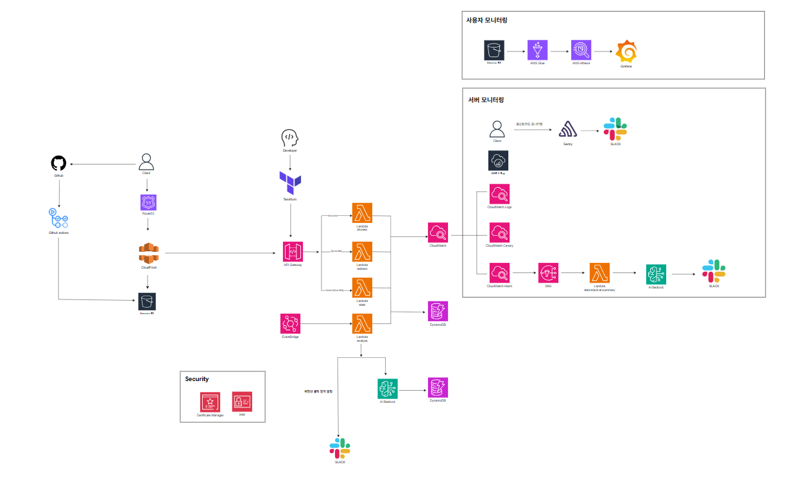

---

## ✨ 주요기능

### 1️⃣ **URL 단축 생성**
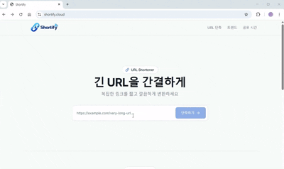

- 긴 URL을 짧은 코드(`shortId`)로 변환해 `shortUrl` 발급
- `POST /shorten`

### 2️⃣ **리다이렉트 + 클릭 로깅**
  - `shortId`로 접속 시 원본 URL로 이동(301/302) + 클릭 이벤트 저장
  - “리다이렉트 발생”만 클릭으로 인정(복사 버튼 등은 미집계)
  - `GET /{shortId}`

### 3️⃣ **AI 트렌드/인사이트 생성 및 제공**
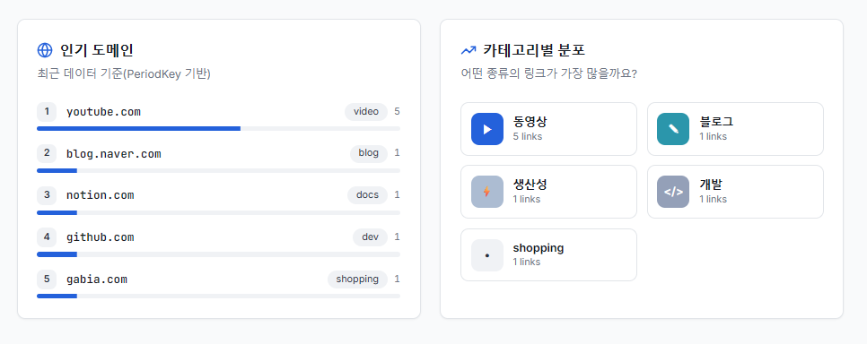 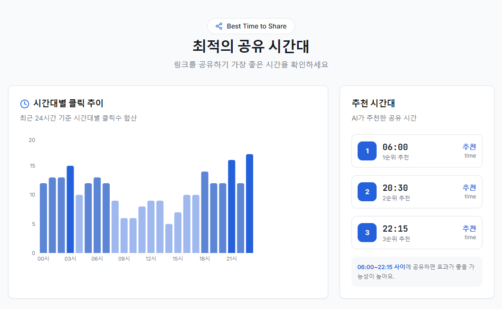
  - 클릭 데이터 기반 트렌드/인사이트를 Bedrock으로 생성해 `ai` 저장
  - 기간별 최신 1건 조회 API 제공
  - `GET /ai/latest`
  - Trend AI 모델 : NOVA Micro
  - Insight AI 모델 : NOVA Lite


### 4️⃣ **비정상(의심) 클릭 감지 + 알림**
  - 봇 UA / 짧은 시간 반복 클릭(burst) 등 탐지
  - `suspiciousClicks`, `suspiciousRate` 저장
  - 임계치 초과 시 Slack 알림


---

## 📡  모니터링

### 1. 사용자 모니터링 (User Analytics)

**목적**  
클릭 데이터를 기반으로 **사용자 행동/유입/패턴**을 분석하고, **비정상(의심) 클릭**을 감지해 Slack으로 알림을 전송합니다.

**데이터 흐름**  
`DynamoDB(clicks) → analyze Lambda → S3 → Glue → Athena → Grafana`

#### 📈 **Grafana 대시보드**  
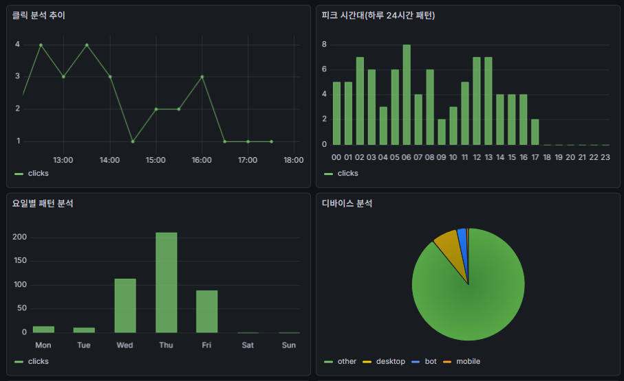&nbsp;&nbsp;
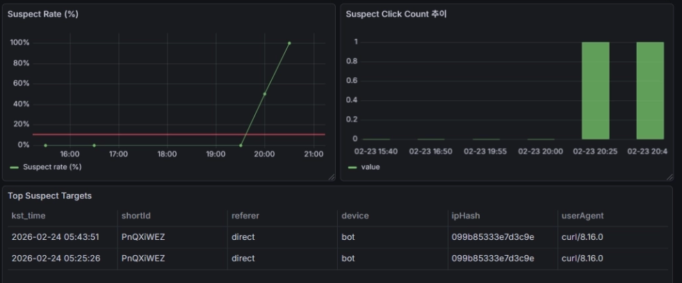
- 클릭 추이(Trend)
- 피크 시간대(24h 패턴)
- 요일별 패턴
- 디바이스 분석
- 유입 경로(Referer)
- 비정상 클릭 감지
  - Suspect Rate(%)
  - Suspect Click Count
  - Top Suspect Targets

#### 🚨 Slack 알림 (비정상 클릭)

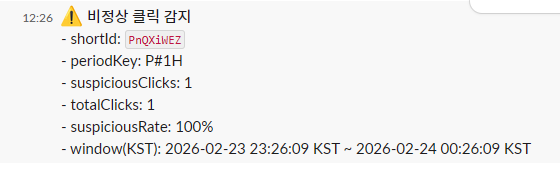

- 임계치 초과 시 **Slack 알림 전송**


---

### 2. 개발자 모니터링 (Ops / Observability)

**목적**  
API/Lambda/DynamoDB의 **트래픽·에러·지연·배치 상태·가용성**을 관측하고, 문제 발생 시 빠르게 원인 추적/대응합니다.

#### 1️⃣ 메트릭 & 알림 (CloudWatch + SNS + Slack)


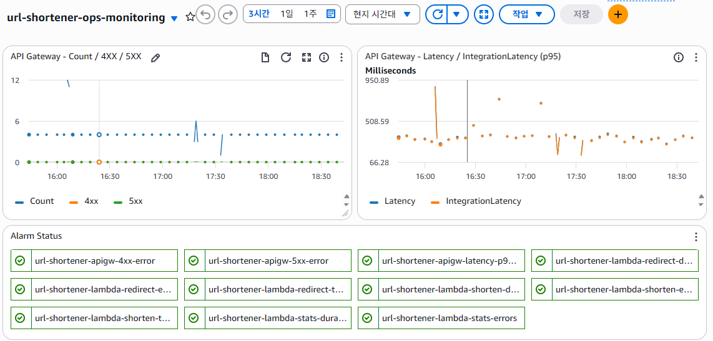&nbsp;
&nbsp;
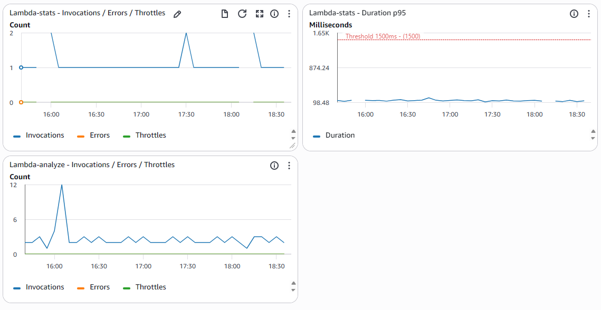

- 도구: CloudWatch Metrics / CloudWatch Alarms / CloudWatch Dashboard, SNS, Slack 전송 Lambda
- 목적: API/Lambda/DynamoDB의 **트래픽·에러·지연**을 수치로 감지하고, 임계치 초과 시 **Slack 알림**으로 즉시 대응
- 대상: **API Gateway / Lambda**
- 주요 지표: 4xx, 5xx, Latency(p95), Errors, Duration(p95), Throttles
- 알림 흐름: `CloudWatch Alarm → SNS → AI 요약 Lambda → Bedrock 요약 → Slack`

**🚨 Slack Alert**
<br />
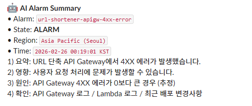

<br />
<br />

#### 2️⃣ 로그 & 쿼리 (CloudWatch Logs + Logs Insights)

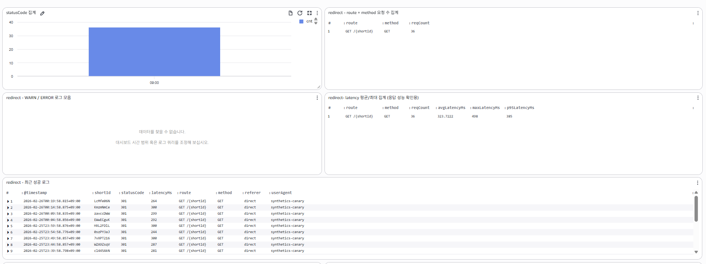&nbsp;


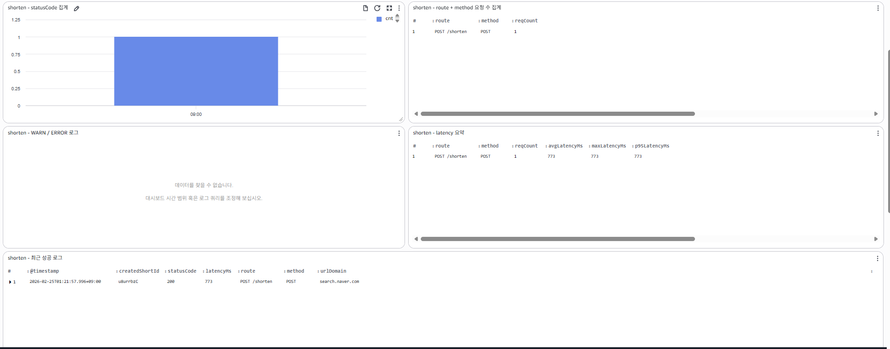&nbsp;
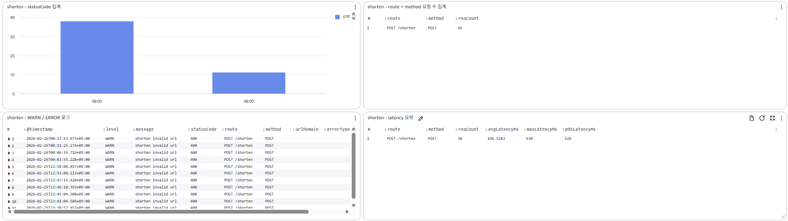

- 도구: CloudWatch Logs / Logs Insights
- 목적: 요청 단위 원인 추적(에러 스택, 특정 shortId, UA/Referer 필터)
- 주요 지표: 라우트별 요청 수 / statusCode 분포 / 응답 성능(p95) 요약


<br />
<br />

#### 3️⃣ 스케줄/배치 모니터링 (EventBridge + CloudWatch)
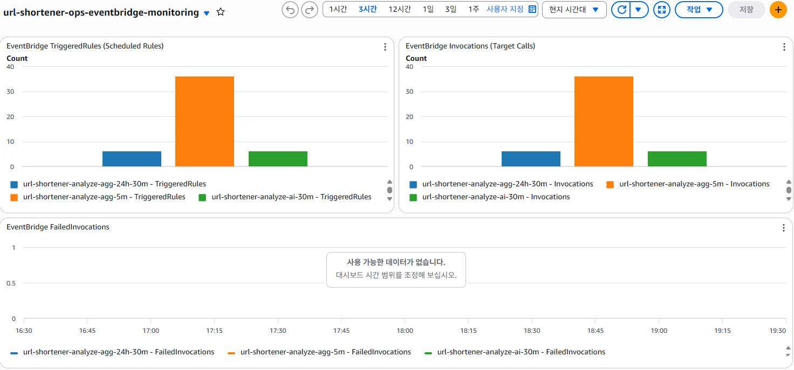

- 도구: EventBridge + CloudWatch Metrics
- 목적: 배치가 주기대로 트리거되는지, analyze Lambda 호출/실패 여부 감시
- 주요 지표: TriggeredRules / Invocations / FailedInvocations


<br />
<br />

#### 4️⃣ 가용성(E2E) (CloudWatch Synthetics Canary)

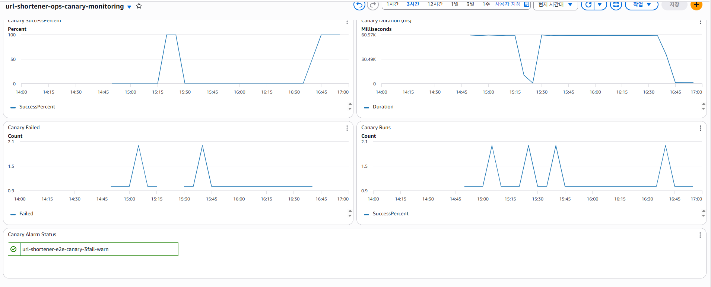&nbsp;
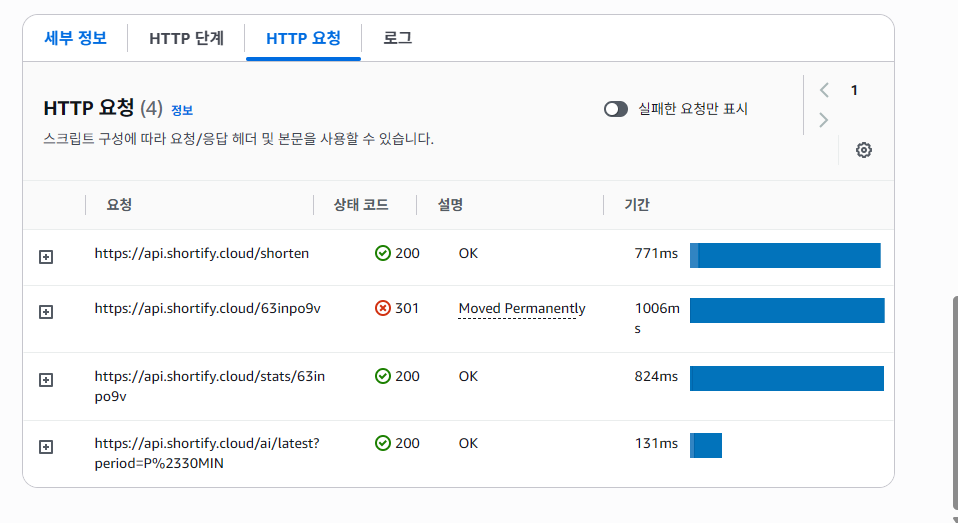

- 도구: CloudWatch Synthetics (Canary)
- 목적: 실제트래픽이 없어도 주요 API 흐름을 주기적으로 검증
- 시나리오: 단축 생성 / 리다이렉트 / 통계 조회 / AI 조회
- 실패 기준: **3회 연속 실패 시 Alarm**


<br />
<br />

#### 5️⃣ 트레이싱(병목 분석) (AWS X-Ray)
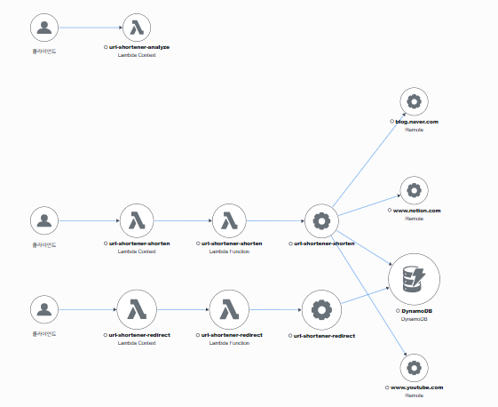&nbsp;
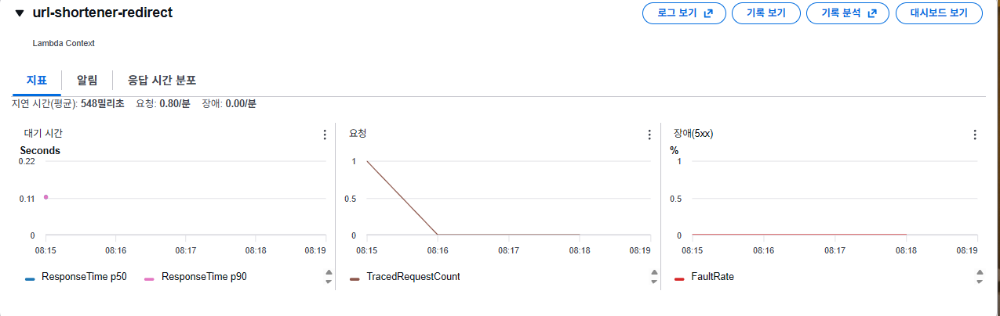
- 도구: AWS X-Ray
- 목적: API GW → Lambda → DynamoDB 구간 지연/병목 확인
- Service Map + Trace 타임라인으로 원인 확정


<br />
<br />

#### 6️⃣ 프론트 에러/성능(품질) (Sentry)
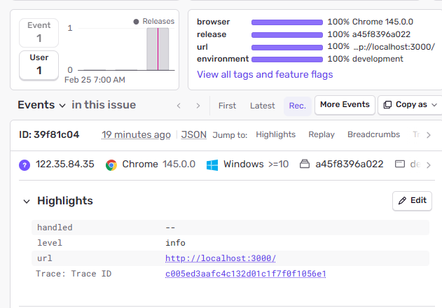&nbsp;
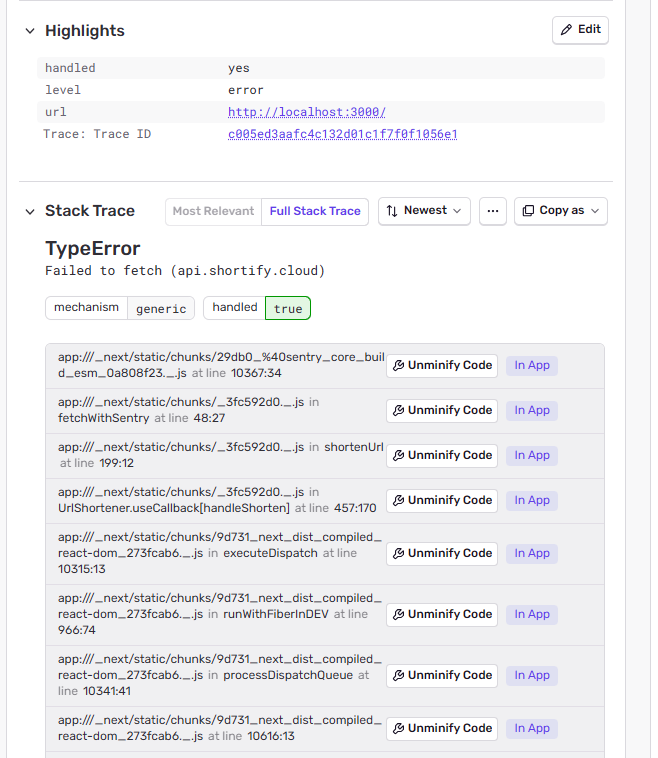&nbsp;
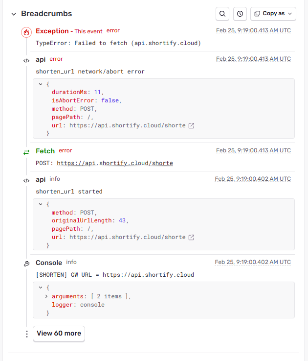

- 도구: Sentry
- 목적: 브라우저 JS 에러 / API 실패 / 성능 저하를 이슈 트래킹
- Issues(빈도/사용자 수) + Performance(느린 트랜잭션) + Slack 알림


### 🚨 **Slack / Email Alert**
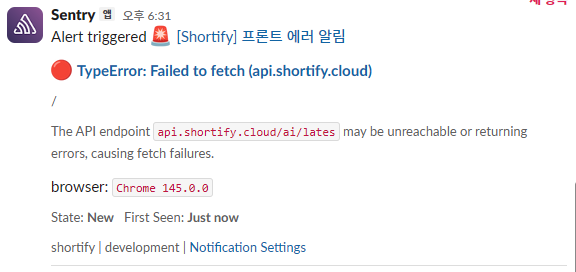&nbsp;
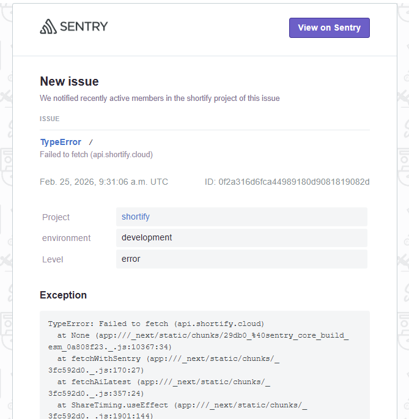&nbsp;
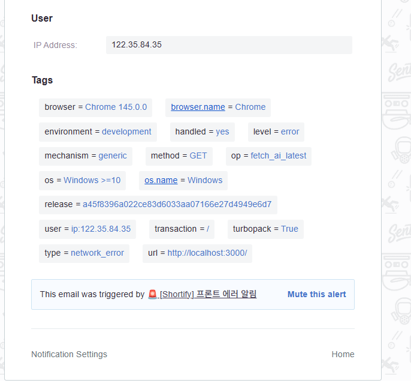

<br />
<br />

## 🔌 API Endpoints

| Method | Endpoint | Description |
| --- | --- | --- |
| POST | `/shorten` | URL 단축 생성 (`{ url, title? }` → `{ shortId, shortUrl }`) |
| GET | `/{shortId}` | 리다이렉트 + 클릭 로깅 (`301/302 Redirect`) |
| GET | `/stats/{shortId}` | 클릭 통계 조회(집계 결과) |
| GET | `/ai/latest` | AI 분석 최신 1건 조회 (Query: `periodKey`, default `P#30MIN`) |

---

## 🗂️ 프로젝트 구조

```text
url-shortener/
├── infra/                      # Terraform (AWS 인프라)
│   ├── main.tf
│   ├── variables.tf
│   ├── outputs.tf
│   └── modules/
│       ├── dynamodb/
│       │   ├── main.tf
│       │   ├── variables.tf
│       │   └── outputs.tf
│       ├── iam/
│       ├── lambda/
│       ├── apigw/
│       ├── acm_cloudfront/
│       ├── frontend/
│       ├── oidc/
│       ├── monitoring/
│       ├── monitoring_ops/
│       └── monitoring_canary/
│
└── lambda/                     # Lambda Python 코드
    ├── shorten/
    │   └── handler.py
    ├── redirect/
    ├── stats/
    ├── analyze/
    ├── alert_slack/
    └── alert_slack_ai/
```
---
## 🚀 로컬실행방법

### 1) Prerequisites
- Terraform >= v1.5
- AWS CLI
- AWS 계정 
- Python v3.11

### 2) AWS 설정
```text
aws configure
```

### 3) Terraform 배포
```text
cd infra
terraform init
terraform apply
```

### 4) frontend 배포
```text
cd frontend
npm install
npm run dev
```

### 5) 환경변수

#### Terraform(tfvars)
```text
slack_webhook_url = "slack 알림 받을 slack url"
slack_webhook_url_ai_summary = "ai 요약 알림 받을 slack url"
```

#### Frontend (.env.local)
```text
NEXT_PUBLIC_API_GATEWAY_URL=https://api.shortify.cloud
NEXT_PUBLIC_SENTRY_DSN=Sentry에서 발급되는 DSN
```


